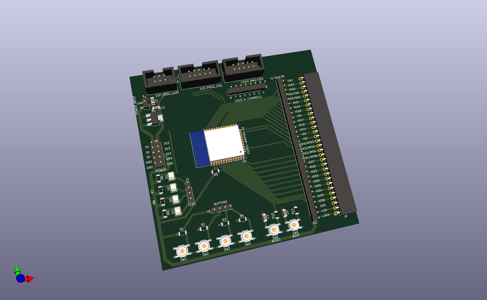

# ESP32 Development Board

## Why a new development board?

Currently, there are many different development boards for ESP32 available on the market. I have also been using various different ones - ESP32-Cam, ESP32 WROOM, ESP32 WROOM on a board with buttons, MicroUSB port, and GPIO ports, ESP32 module with an LCD display, etc. Every board has some nice features, but overall I have always been missing the things that I believe a dev board should have:

- easy access to GPIO; most of the boards have a really inconvenient access to GPIO pins, making it harder to connect/disconnect cables
- properly described microcontroller pins, especially GPIO. This is the thing that widely used boards do the worst. Instead of using real pin descriptions, most of them use Arduino-based numbers (like 1, 2, 3 instead of GPIO01, GPIO02, etc). It may not be a big deal while using Arduino, but it's really problematic when using ESP-IDF
- easy to connect a logic analyzer or oscilloscope to GPIO. If not using a breadboard, it's complicated to connect two cables to one GPIO
- dedicated port for JTAG and serial port
- a few buttons and LEDs for generic purposes
- LOTS of power and GND pins

This made me think to create a new development board to address all of those issues.

## Features

1. Easy access to GPIO boards with clear descriptions
2. Designed to work with popular Saleae logic analyzer but compatible with all logic analyzers or oscilloscopes
3. Compatible with [ESP-Prog](https://docs.espressif.com/projects/espressif-esp-iot-solution/en/latest/hw-reference/ESP-Prog_guide.html) JTAG and UART
4. General purpose buttons and LEDs
5. Easily accessible power pins (5V, 3.3V and GND) on both sides of the board

## Opening project
Just open projects files in KiCad. Every symbol and footpring should be automatically imported.

## Contributing

Just create a Pull Request with your changes, make sure to describe and explain the changes you would like to make. If you'll encounter any errors, [feel free to create an issue.](https://github.com/adammruk/esp32-devboard/issues)

